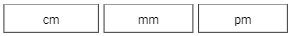

# PDF module

This module allows you to create PDF design templates using more suitable XML syntax
and load them directly into a code. From code, you are able to access every single element 
by a specific id to set your data to your PDF template.

See topics:
- [TODOs](#todos)
- [Technology stack](#technology-stack)
- [Implementation into project](#implementation-into-project)
- [How to design PDF](#how-to-design-pdf)
- [Find element by id](#find-element-by-id)
- [Sizing](#sizing)
- [Property file](#property-file)
- [Elements, XML tags and possibilities](#elements-xml-tags-and-possibilities)

## TODOs
- [x] Static page with fix positioning
- [ ] Automatic drawing of an element to next page when end of page was reach
  - [x] Draw items vertically in linear order
  - [ ] Enable to draw rest items of ListContainer to next page without moving whole element
- [ ] Create TableContainer
- [ ] Create Header and Footer elements
- [ ] Implement wrapping option to Text element
- [ ] Provide builder pattern to create elements for more comfortable usage in Java
- [ ] Remove styling from tables in documentation
- [ ] Add option to load texts and sizes from properties file
- [x] Add option to insert sizes for both millimeters and points per millimeter

### Bugs
- [x] LinearContainer's child elements with weigh parameter set does not fill to parent height and set own height to 0

## Technology stack
Project is creating using Kotlin language with compatibility to Java 11 and Gradle 
as a build automation tool.

|Name|Version|
|---|---|
|Kotlin|1.5.31|
|Gradle|7.2|

### Libraries
Module implements [Apache PDFBox](https://pdfbox.apache.org/) to create PDF file and 
[JSON-Java](https://github.com/stleary/JSON-java) to handle templates written in XML 
and transform them to code definition.

|Name|Version||
|---|---|---|
|Apache PDFBox|3.0.0-RC1|[📦](https://mvnrepository.com/artifact/org.apache.pdfbox/pdfbox "Maven repository")|
|JSON-Java|20210307|[📦](https://mvnrepository.com/artifact/org.json/json "Maven repository")|

## Implementation into project
The module is not yet published in any of public repositories. Therefore, the only way how to implement
the module into your project is to build it on your own and implement it as .jar or, alternatively, 
implement it directly as module to your project.

### as module
Open terminal in your project directory and run this script:
```shell
# Download as git project:
$ git clone <module-pdf-git-url> module-pdf

# or rather as git submodule if you are using git already:
$ git submodule add <module-pdf-git-url> module-pdf
```
If you want to implement module directly to your project repository delete .git metadata 
folder from module:
```shell
$ rm -rf module-pdf/.git

# In case you implement the module as git submodule do also: 
$ git rm --cached module-pdf
$ git rm .gitmodules
```
Now add the module into the project dependencies:
```groovy
// Include the module in the project settings.gradle:
include ":module-pdf"

// and implement the module as dependency in the project build.gradle:
dependencies {
  implementation project(':module-pdf')
  ...
}
```
_(Learn more about declaring dependencies in gradle [here.](https://docs.gradle.org/current/userguide/declaring_dependencies.html))_

If you are using **Maven** as project management and comprehension tool see [documentation](https://maven.apache.org/index.html).

### as .jar
tbd

## How to design PDF:
There are two possibilities how PDF can be designed. Only by code using prepared
elements or easily by creating XML template.

### by XML template
XML templates have to be in strict format. Root tag is `<pdf>` where you can define
your pages. Tag `<pdf>` is necessary to generate PDF file because it represents the
**Pdf** object defined in code that is responsible for generating. Page is the only place
where you can insert your element tags that will be drawn while generating, as `<text>`
element in example. All elements and XML tags are described [here](#elements-xml-tags-and-possibilities).

#### Example - fromString()
This is a basic implementation. This example creates PDF file called _generated.pdf_ in
application root folder with one page and **Hello, World!** text.
```java
...
String xml = "<pdf><absolutePage><Text gravity=\"center\" text=\"Hello, World!\"/></absolutePage></pdf>";
Pdf.fromString(xml).save("generated.pdf");
...
```
You can also load XML from file in resource folder or save PDF file to your
OutputStream for future purposes.

#### Example - fromResource()
tbd

### by Java/Kotlin code only
tbd

## Find element by id
tbd

## Sizing
There are three possible ways how to declare an any dimension like a **width**, 
**height** or a **padding**. The most basic one is declaration using points per 
millimeters represents by suffix `pm`. Next two are more traditional. These 
are millimeters (suffix: `mm`) and centimeters (suffix: `cm`).

### Page dimensions by type
|Page type|Millimeters|Points per millimeters|
|---|---|---|
|A2|width = 420mm <br/> height = 594mm|width ≐ 1190.55pm <br/> height ≐ 1683.78pm|
|A3|width = 297mm <br/> height = 420mm|width ≐ 841.89pm <br/> height ≐ 1190.55pm|
|A4|width = 210mm <br/> height = 297mm|width ≐ 595.28pm <br/> height ≐ 841.89pm|
|A5|width = 148mm <br/> height = 210mm|width ≐ 419.52pm <br/> height ≐ 595.28pm|

### Transfer millimeters to points per millimeters

```java 
<points-per-millimeters> = (1 / (10 * 2.54) * 72) * <millimeters>
```

### Example
This is a definition of same sized containers in all three dimension types:
```xml
<linearContainer orientation="horizontal" width="100mm" gravity="center">
  <absoluteContainer weigh="1" height="1cm" strokeWidth="0.5">
    <text text="cm" gravity="center" />
  </absoluteContainer>
  <absoluteContainer weigh="1" height="10mm" strokeWidth="0.5" paddingLeft="2mm">
    <text text="mm" gravity="center" />
  </absoluteContainer>
  <absoluteContainer weigh="1" height="28.35pm" strokeWidth="0.5" paddingLeft="2mm">
    <text text="pm" gravity="center" />
  </absoluteContainer>
</linearContainer>
```
and this is output:
<br/>

## Property file
tbd

## Elements, XML tags and possibilities
This is a list of all elements you can use to design your PDF file:

|Class name|XML tag|Description|
|---|---|---|
|[Pdf](#pdf)|`<pdf>`|-|
|[AbsolutePage](#absolutepage)|`<absolutePage>`|-|
|[LinearPage](#linearPage)|`<linearPage>`|-|
|[AbsoluteContainer](#absolutecontainer)|`<absoluteContainer>`|-|
|[LinearContainer](#linearcontainer)|`<linearContainer>`|-|
|[ListContainer](#listcontainer)|`<listContainer>`|-|
|[Text](#text)|`<text>`|-|

### Pdf
tbd
<table>
    <thead>
        <tr>
            <th>Property name</th>
            <th>Type</th>
            <th>Nullable</th>
            <th>Default value</th>
            <th>Description</th>
        </tr>
    </thead>
    <tbody>
        <tr>
            <td align="left" valign="top" rowspan="2">pageType</td>
            <td align="center" valign="top" rowspan="2">Enum</td>
            <td align="center" valign="top" rowspan="2">No</td>
            <td align="center" valign="top" rowspan="2">A4</td>
            <td align="left" valign="middle" rowspan="1">Global size of all pages in the PDF.</td>
        </tr>
        <tr><td align="left" valign="middle"> <i>Possible values: A2, A3, A4, A5</i></td></tr>
    </tbody>
</table>

#### XML full definition:
```xml
<pdf pageType="A4">...</pdf>
```

### AbsolutePage
tbd
<table>
    <thead>
        <tr>
            <th>Property name</th>
            <th>Type</th>
            <th>Nullable</th>
            <th>Default value</th>
            <th>Description</th>
        </tr>
    </thead>
    <tbody>
        <tr>
            <td align="left" valign="top" rowspan="2">pageType</td>
            <td align="center" valign="top" rowspan="2">Enum</td>
            <td align="center" valign="top" rowspan="2">No</td>
            <td align="center" valign="top" rowspan="2">A4</td>
            <td align="left" valign="middle" rowspan="1">Size of a page. Declaration this property on the page overwrites global definition from <code>&lt;pdf&gt;</code> tag.</td>
        </tr>
        <tr><td align="left" valign="middle"> <i>Possible values: A2, A3, A4, A5</i></td></tr>
    </tbody>
</table>

#### XML full definition:
```xml
<absolutePage pageType="A4">...</absolutePage>
```

### LinearPage
tbd
<table>
    <thead>
        <tr>
            <th>Property name</th>
            <th>Type</th>
            <th>Nullable</th>
            <th>Default value</th>
            <th>Description</th>
        </tr>
    </thead>
    <tbody>
        <tr>
            <td align="left" valign="top" rowspan="2">pageType</td>
            <td align="center" valign="top" rowspan="2">Enum</td>
            <td align="center" valign="top" rowspan="2">No</td>
            <td align="center" valign="top" rowspan="2">A4</td>
            <td align="left" valign="middle" rowspan="1">Size of a page. Declaration this property on the page overwrites global definition from <code>&lt;pdf&gt;</code> tag.</td>
        </tr>
        <tr><td align="left" valign="middle"> <i>Possible values: A2, A3, A4, A5</i></td></tr>
        <tr>
            <td align="left" valign="top" rowspan="1">dynamic</td>
            <td align="center" valign="top" rowspan="1">Boolean</td>
            <td align="center" valign="top" rowspan="1">No</td>
            <td align="center" valign="top" rowspan="1">false</td>
            <td align="left" valign="middle" rowspan="1">Set to true if the page has to draw items dynamically. It means that a new page is automatically created when the end of an actual page is reached and a generating process continues drawing on the new one.</td>
        </tr>
        <tr></tr>
    </tbody>
</table>

#### XML full definition:
```xml
<linearPage 
        pageType="A4"
        dynamic="true">...</linearPage>
```

### AbsoluteContainer
tbd
<table>
    <thead>
        <tr>
            <th>Property name</th>
            <th>Type</th>
            <th>Nullable</th>
            <th>Default value</th>
            <th>Description</th>
        </tr>
    </thead>
    <tbody>
        <tr>
            <td align="left" valign="top" rowspan="1">id</td>
            <td align="center" valign="top" rowspan="1">String</td>
            <td align="center" valign="top" rowspan="1">Yes</td>
            <td align="center" valign="top" rowspan="1">null</td>
            <td align="left" valign="middle" rowspan="1">Identification of an element by which you can load it in code and fill it with data.</td>
        </tr>
        <tr></tr>
        <tr>
            <td align="left" valign="top" rowspan="2">gravity</td>
            <td align="center" valign="top" rowspan="2">Enum</td>
            <td align="center" valign="top" rowspan="2">No</td>
            <td align="center" valign="top" rowspan="2">left top</td>
            <td align="left" valign="middle" rowspan="1">Relative position of an element in parent. It is possible to combine flags with space as a separator (eg.: <code>gravity="top center_horizontal"</code>).</td>
        </tr>
        <tr><td align="left" valign="middle"><i>Possible values: left, top, bottom, right, center_horizontal, center_vertical, center</i></td></tr>
        <tr>
            <td align="left" valign="top" rowspan="1">padding</td>
            <td align="center" valign="top" rowspan="1">Float</td>
            <td align="center" valign="top" rowspan="1">No</td>
            <td align="center" valign="top" rowspan="1">0</td>
            <td align="left" valign="middle" rowspan="1">All side padding of an element. Padding is applied according to gravity (eg.: paddingLeft does not apply to element with gravity set to right).</td>
        </tr>
        <tr></tr>
        <tr>
            <td align="left" valign="top" rowspan="1">paddingLeft</td>
            <td align="center" valign="top" rowspan="1">Float</td>
            <td align="center" valign="top" rowspan="1">No</td>
            <td align="center" valign="top" rowspan="1">0</td>
            <td align="left" valign="middle" rowspan="1">Left side padding of an element. Padding is applied according to gravity (eg.: paddingLeft does not apply to element with gravity set to right). Overwrites global padding property for left side only.</td>
        </tr>
        <tr></tr>
        <tr>
            <td align="left" valign="top" rowspan="1">paddingTop</td>
            <td align="center" valign="top" rowspan="1">Float</td>
            <td align="center" valign="top" rowspan="1">No</td>
            <td align="center" valign="top" rowspan="1">0</td>
            <td align="left" valign="middle" rowspan="1">Top side padding of an element. Padding is applied according to gravity (eg.: paddingTop does not apply to element with gravity set to bottom). Overwrites global padding property for top side only.</td>
        </tr>
        <tr></tr>
        <tr>
            <td align="left" valign="top" rowspan="1">paddingRight</td>
            <td align="center" valign="top" rowspan="1">Float</td>
            <td align="center" valign="top" rowspan="1">No</td>
            <td align="center" valign="top" rowspan="1">0</td>
            <td align="left" valign="middle" rowspan="1">Right side padding of an element. Padding is applied according to gravity (eg.: paddingRight does not apply to element with gravity set to left). Overwrites global padding property for right side only.</td>
        </tr>
        <tr></tr>
        <tr>
            <td align="left" valign="top" rowspan="1">paddingBottom</td>
            <td align="center" valign="top" rowspan="1">Float</td>
            <td align="center" valign="top" rowspan="1">No</td>
            <td align="center" valign="top" rowspan="1">0</td>
            <td align="left" valign="middle" rowspan="1">Bottom side padding of an element. Padding is applied according to gravity (eg.: paddingBottom does not apply to element with gravity set to top). Overwrites global padding property for bottom side only</td>
        </tr>
        <tr></tr>
        <tr>
            <td align="left" valign="top" rowspan="2">width</td>
            <td align="center" valign="top" rowspan="2">Enum / Float</td>
            <td align="center" valign="top" rowspan="2">No</td>
            <td align="center" valign="top" rowspan="2">fill_parent</td>
            <td align="left" valign="middle" rowspan="1">Width of an element. Can be set as a fix float or relatively to a maximal possible width in parent or as a minimal possible size according to the content.</td>
        </tr>
        <tr><td align="left" valign="middle"><i>Possible values: fill_parent, wrap_content</i></td></tr>
        <tr>
            <td align="left" valign="top" rowspan="2">height</td>
            <td align="center" valign="top" rowspan="2">Enum / Float</td>
            <td align="center" valign="top" rowspan="2">No</td>
            <td align="center" valign="top" rowspan="2">fill_parent</td>
            <td align="left" valign="middle" rowspan="1">Height of an element. Can be set as a fix float or relatively to a maximal possible height in parent or as a minimal possible size according to the content.</td>
        </tr>
        <tr><td align="left" valign="middle"><i>Possible values: fill_parent, wrap_content</i></td></tr>
        <tr>
            <td align="left" valign="top" rowspan="2">strokeColor</td>
            <td align="center" valign="top" rowspan="2">Enum</td>
            <td align="center" valign="top" rowspan="2">No</td>
            <td align="center" valign="top" rowspan="2">black</td>
            <td align="left" valign="middle" rowspan="1">Border color of an element.</td>
        </tr>
        <tr><td align="left" valign="middle"><i>Possible values: black, blue</i></td></tr>
        <tr>
            <td align="left" valign="top" rowspan="1">strokeWidth</td>
            <td align="center" valign="top" rowspan="1">Float</td>
            <td align="center" valign="top" rowspan="1">No</td>
            <td align="center" valign="top" rowspan="1">0</td>
            <td align="left" valign="middle" rowspan="1">Border width of an element.</td>
        </tr>
        <tr></tr>
    </tbody>
</table>

#### XML full definition:
```xml
<absoluteContainer  
        id="containerId"
        gravity="left top"
        paddingLeft="0"
        paddingTop="0"
        paddingRight="0"
        paddingBottom="0"
        width="fill_parent"
        height="fill_parent"
        strokeColor="black"
        strokeWidth="0">...</absoluteContainer>
```

### LinearContainer
tbd
<table>
    <thead>
        <tr>
            <th>Property name</th>
            <th>Type</th>
            <th>Nullable</th>
            <th>Default value</th>
            <th>Description</th>
        </tr>
    </thead>
    <tbody>
        <tr>
            <td align="left" valign="top" rowspan="1">id</td>
            <td align="center" valign="top" rowspan="1">String</td>
            <td align="center" valign="top" rowspan="1">Yes</td>
            <td align="center" valign="top" rowspan="1">null</td>
            <td align="left" valign="middle" rowspan="1">Identification of an element by which you can load it in code and fill it with data.</td>
        </tr>
        <tr></tr>
        <tr>
            <td align="left" valign="top" rowspan="2">gravity</td>
            <td align="center" valign="top" rowspan="2">Enum</td>
            <td align="center" valign="top" rowspan="2">No</td>
            <td align="center" valign="top" rowspan="2">left top</td>
            <td align="left" valign="middle" rowspan="1">Relative position of an element in parent. It is possible to combine flags with space as separator (eg.: <code>gravity="top center_horizontal"</code>).</td>
        </tr>
        <tr><td align="left" valign="middle"><i>Possible values: left, top, bottom, right, center_horizontal, center_vertical, center</i></td></tr>
        <tr>
            <td align="left" valign="top" rowspan="1">padding</td>
            <td align="center" valign="top" rowspan="1">Float</td>
            <td align="center" valign="top" rowspan="1">No</td>
            <td align="center" valign="top" rowspan="1">0</td>
            <td align="left" valign="middle" rowspan="1">All side padding of an element. Padding is applied according to gravity (eg.: paddingLeft does not apply to element with gravity set to right).</td>
        </tr>
        <tr></tr>
        <tr>
            <td align="left" valign="top" rowspan="1">paddingLeft</td>
            <td align="center" valign="top" rowspan="1">Float</td>
            <td align="center" valign="top" rowspan="1">No</td>
            <td align="center" valign="top" rowspan="1">0</td>
            <td align="left" valign="middle" rowspan="1">Left side padding of an element. Padding is applied according to gravity (eg.: paddingLeft does not apply to element with gravity set to right). Overwrites global padding property for left side only.</td>
        </tr>
        <tr></tr>
        <tr>
            <td align="left" valign="top" rowspan="1">paddingTop</td>
            <td align="center" valign="top" rowspan="1">Float</td>
            <td align="center" valign="top" rowspan="1">No</td>
            <td align="center" valign="top" rowspan="1">0</td>
            <td align="left" valign="middle" rowspan="1">Top side padding of an element. Padding is applied according to gravity (eg.: paddingTop does not apply to element with gravity set to bottom). Overwrites global padding property for top side only.</td>
        </tr>
        <tr></tr>
        <tr>
            <td align="left" valign="top" rowspan="1">paddingRight</td>
            <td align="center" valign="top" rowspan="1">Float</td>
            <td align="center" valign="top" rowspan="1">No</td>
            <td align="center" valign="top" rowspan="1">0</td>
            <td align="left" valign="middle" rowspan="1">Right side padding of an element. Padding is applied according to gravity (eg.: paddingRight does not apply to element with gravity set to left). Overwrites global padding property for right side only.</td>
        </tr>
        <tr></tr>
        <tr>
            <td align="left" valign="top" rowspan="1">paddingBottom</td>
            <td align="center" valign="top" rowspan="1">Float</td>
            <td align="center" valign="top" rowspan="1">No</td>
            <td align="center" valign="top" rowspan="1">0</td>
            <td align="left" valign="middle" rowspan="1">Bottom side padding of an element. Padding is applied according to gravity (eg.: paddingBottom does not apply to element with gravity set to top). Overwrites global padding property for bottom side only</td>
        </tr>
        <tr></tr>
        <tr>
            <td align="left" valign="top" rowspan="2">width</td>
            <td align="center" valign="top" rowspan="2">Enum / Float</td>
            <td align="center" valign="top" rowspan="2">No</td>
            <td align="center" valign="top" rowspan="2">fill_parent</td>
            <td align="left" valign="middle" rowspan="1">Width of an element. Can be set as a fix float or relatively to a maximal possible width in parent or as a minimal possible size according to the content.</td>
        </tr>
        <tr><td align="left" valign="middle"><i>Possible values: fill_parent, wrap_content</i></td></tr>
        <tr>
            <td align="left" valign="top" rowspan="2">height</td>
            <td align="center" valign="top" rowspan="2">Enum / Float</td>
            <td align="center" valign="top" rowspan="2">No</td>
            <td align="center" valign="top" rowspan="2">fill_parent</td>
            <td align="left" valign="middle" rowspan="1">Height of an element. Can be set as a fix float or relatively to a maximal possible height in parent or as a minimal possible size according to the content.</td>
        </tr>
        <tr><td align="left" valign="middle"><i>Possible values: fill_parent, wrap_content</i></td></tr>
        <tr>
            <td align="left" valign="top" rowspan="2">strokeColor</td>
            <td align="center" valign="top" rowspan="2">Enum</td>
            <td align="center" valign="top" rowspan="2">No</td>
            <td align="center" valign="top" rowspan="2">black</td>
            <td align="left" valign="middle" rowspan="1">Border color of an element.</td>
        </tr>
        <tr><td align="left" valign="middle"><i>Possible values: black, blue</i></td></tr>
        <tr>
            <td align="left" valign="top" rowspan="1">strokeWidth</td>
            <td align="center" valign="top" rowspan="1">Float</td>
            <td align="center" valign="top" rowspan="1">No</td>
            <td align="center" valign="top" rowspan="1">0</td>
            <td align="left" valign="middle" rowspan="1">Border width of an element.</td>
        </tr>
        <tr></tr>
        <tr>
            <td align="left" valign="top" rowspan="2">orientation</td>
            <td align="center" valign="top" rowspan="2">Enum</td>
            <td align="center" valign="top" rowspan="2">No</td>
            <td align="center" valign="top" rowspan="2">vertical</td>
            <td align="left" valign="middle" rowspan="1">Orientation declares in which way are child elements drawn.</td>
        </tr>
        <tr><td align="left" valign="middle"><i>Possible values: vertical, horizontal</i></td></tr>
        </tbody>
</table>

#### Special properties
<table>
    <thead>
        <tr>
            <th>Property name</th>
            <th>Type</th>
            <th>Nullable</th>
            <th>Default value</th>
            <th>Description</th>
        </tr>
    </thead>
    <tbody>
        <tr>
            <td align="left" valign="top" rowspan="1">weigh</td>
            <td align="center" valign="top" rowspan="1">Integer</td>
            <td align="center" valign="top" rowspan="1">Yes</td>
            <td align="center" valign="top" rowspan="1">null</td>
            <td align="left" valign="middle" rowspan="1">This special property applies to child elements. It represents a ratio of a size according to other elements. It uses width or height dependinng on the orientation of a container. If weigh is defined on a child element, the set size is ignored and new will be calculated automatically.</td>
        </tr>
        <tr></tr>
    </tbody>
</table>

#### XML full definition:
```xml
<linearContainer  
        id="containerId"
        gravity="left top"
        paddingLeft="0"
        paddingTop="0"
        paddingRight="0"
        paddingBottom="0"
        width="fill_parent"
        height="fill_parent"
        strokeColor="black"
        strokeWidth="0"
        orientation="vertical">...</linearContainer>
```

#### XML definition with weigh:
```xml
<linearContainer>
  <absoluteContainer weigh="1">...</absoluteContainer>
  <absoluteContainer weigh="2">...</absoluteContainer>
  <absoluteContainer height="100">...</absoluteContainer>
</linearContainer>
```


### ListContainer
List container has the same properties as a LinearContainer. Unlike the others containers
this cannot process child elements from the XML definition. An adapter defined in code 
generates child elements by providing element template. 

An element template can be designed in the same way as PDF template. Just define XML 
without pdf tag and pages.

<table>
    <thead>
        <tr>
            <th>Property name</th>
            <th>Type</th>
            <th>Nullable</th>
            <th>Default value</th>
            <th>Description</th>
        </tr>
    </thead>
    <tbody>
        <tr>
            <td align="left" valign="top" rowspan="1">id</td>
            <td align="center" valign="top" rowspan="1">String</td>
            <td align="center" valign="top" rowspan="1">Yes</td>
            <td align="center" valign="top" rowspan="1">null</td>
            <td align="left" valign="middle" rowspan="1">Identification of an element by which you can load it in code and fill it with data.</td>
        </tr>
        <tr></tr>
        <tr>
            <td align="left" valign="top" rowspan="2">gravity</td>
            <td align="center" valign="top" rowspan="2">Enum</td>
            <td align="center" valign="top" rowspan="2">No</td>
            <td align="center" valign="top" rowspan="2">left top</td>
            <td align="left" valign="middle" rowspan="1">Relative position of an element in parent. It is possible to combine flags with space as separator (eg.: <code>gravity="top center_horizontal"</code>).</td>
        </tr>
        <tr><td align="left" valign="middle"><i>Possible values: left, top, bottom, right, center_horizontal, center_vertical, center</i></td></tr>
        <tr>
            <td align="left" valign="top" rowspan="1">padding</td>
            <td align="center" valign="top" rowspan="1">Float</td>
            <td align="center" valign="top" rowspan="1">No</td>
            <td align="center" valign="top" rowspan="1">0</td>
            <td align="left" valign="middle" rowspan="1">All side padding of an element. Padding is applied according to gravity (eg.: paddingLeft does not apply to element with gravity set to right).</td>
        </tr>
        <tr></tr>
        <tr>
            <td align="left" valign="top" rowspan="1">paddingLeft</td>
            <td align="center" valign="top" rowspan="1">Float</td>
            <td align="center" valign="top" rowspan="1">No</td>
            <td align="center" valign="top" rowspan="1">0</td>
            <td align="left" valign="middle" rowspan="1">Left side padding of an element. Padding is applied according to gravity (eg.: paddingLeft does not apply to element with gravity set to right). Overwrites global padding property for left side only.</td>
        </tr>
        <tr></tr>
        <tr>
            <td align="left" valign="top" rowspan="1">paddingTop</td>
            <td align="center" valign="top" rowspan="1">Float</td>
            <td align="center" valign="top" rowspan="1">No</td>
            <td align="center" valign="top" rowspan="1">0</td>
            <td align="left" valign="middle" rowspan="1">Top side padding of an element. Padding is applied according to gravity (eg.: paddingTop does not apply to element with gravity set to bottom). Overwrites global padding property for top side only.</td>
        </tr>
        <tr></tr>
        <tr>
            <td align="left" valign="top" rowspan="1">paddingRight</td>
            <td align="center" valign="top" rowspan="1">Float</td>
            <td align="center" valign="top" rowspan="1">No</td>
            <td align="center" valign="top" rowspan="1">0</td>
            <td align="left" valign="middle" rowspan="1">Right side padding of an element. Padding is applied according to gravity (eg.: paddingRight does not apply to element with gravity set to left). Overwrites global padding property for right side only.</td>
        </tr>
        <tr></tr>
        <tr>
            <td align="left" valign="top" rowspan="1">paddingBottom</td>
            <td align="center" valign="top" rowspan="1">Float</td>
            <td align="center" valign="top" rowspan="1">No</td>
            <td align="center" valign="top" rowspan="1">0</td>
            <td align="left" valign="middle" rowspan="1">Bottom side padding of an element. Padding is applied according to gravity (eg.: paddingBottom does not apply to element with gravity set to top). Overwrites global padding property for bottom side only</td>
        </tr>
        <tr></tr>
        <tr>
            <td align="left" valign="top" rowspan="2">width</td>
            <td align="center" valign="top" rowspan="2">Enum / Float</td>
            <td align="center" valign="top" rowspan="2">No</td>
            <td align="center" valign="top" rowspan="2">fill_parent</td>
            <td align="left" valign="middle" rowspan="1">Width of an element. Can be set as a fix float or relatively to a maximal possible width in parent or as a minimal possible size according to the content.</td>
        </tr>
        <tr><td align="left" valign="middle"><i>Possible values: fill_parent, wrap_content</i></td></tr>
        <tr>
            <td align="left" valign="top" rowspan="2">height</td>
            <td align="center" valign="top" rowspan="2">Enum / Float</td>
            <td align="center" valign="top" rowspan="2">No</td>
            <td align="center" valign="top" rowspan="2">fill_parent</td>
            <td align="left" valign="middle" rowspan="1">Height of an element. Can be set as a fix float or relatively to a maximal possible height in parent or as a minimal possible size according to the content.</td>
        </tr>
        <tr><td align="left" valign="middle"><i>Possible values: fill_parent, wrap_content</i></td></tr>
        <tr>
            <td align="left" valign="top" rowspan="2">strokeColor</td>
            <td align="center" valign="top" rowspan="2">Enum</td>
            <td align="center" valign="top" rowspan="2">No</td>
            <td align="center" valign="top" rowspan="2">black</td>
            <td align="left" valign="middle" rowspan="1">Border color of an element.</td>
        </tr>
        <tr><td align="left" valign="middle"><i>Possible values: black, blue</i></td></tr>
        <tr>
            <td align="left" valign="top" rowspan="1">strokeWidth</td>
            <td align="center" valign="top" rowspan="1">Float</td>
            <td align="center" valign="top" rowspan="1">No</td>
            <td align="center" valign="top" rowspan="1">0</td>
            <td align="left" valign="middle" rowspan="1">Border width of an element.</td>
        </tr>
        <tr></tr>
        <tr>
            <td align="left" valign="top" rowspan="2">orientation</td>
            <td align="center" valign="top" rowspan="2">Enum</td>
            <td align="center" valign="top" rowspan="2">No</td>
            <td align="center" valign="top" rowspan="2">vertical</td>
            <td align="left" valign="middle" rowspan="1">Orientation declares in which way are child elements drawn.</td>
        </tr>
        <tr><td align="left" valign="middle"><i>Possible values: vertical, horizontal</i></td></tr>
    </tbody>
</table>

#### XML full definition:
```xml
<listContainer  
        id="containerId"
        gravity="left top"
        paddingLeft="0"
        paddingTop="0"
        paddingRight="0"
        paddingBottom="0"
        width="fill_parent"
        height="fill_parent"
        strokeColor="black"
        strokeWidth="0"
        orientation="vertical"/>
```

#### Adapter definition:
First define element template as a file or string:
```xml
<absoluteContainer height="wrap_content">
    <text id="itemText"
          gravity="center_horizontal"
          text="Adapter position: %d"/>
</absoluteContainer>
```

Then implement adapter with all related methods:
```java
class TestListContainerAdapter implements ListContainerAdapter {
    @Override
    public @Nullable Element onCreateElement() throws IOException, URISyntaxException {
        return null;
    }

    @Override
    public void onBindElement(@NotNull Element element, int position) {
    }

    @Override
    public int getItemCount() {
        return 0;
    }
}
```

Now provide element template:
```java
...
public @Nullable Element onCreateElement() throws IOException, URISyntaxException {
    // Create an element template from a resource xml file without precalculating
    return Element.fromResource("listItem.xml", false);
}
...
```

Bind data to every element item in list:
```java
...
public void onBindElement(@NotNull Element element, int position) {
    Container container = (Container) element;
    Text text = (Text) container.findElementById("itemText");
    text.formatText(position);
}
...
```

After creating template and binding data set count of items that should be drawn in list:
```java
...
public int getItemCount() {
    return 5;
}
...
```

As last step set adapter into the ListContainer:
```java
...
Pdf pdf = Pdf.fromString("<pdf><absolutePage><listContainer id="list"/></absolutePage></pdf>");
ListContainer listContainer = (ListContainer) pdf.findElementById("list");        
listContainer.setAdapter(new TestListContainerAdapter());        
pdf.save("generated.pdf");
...
```


### Text
This element allows you to draw text into the PDF file. You can set text directly to 
a template or do it via code. There are two methods by which you can set text using code `setText(String text)` 
and `formatText(Objects ... args)`. Format method is similar to `String.format(...)` and 
the String pattern is loaded from the template directly. 

You can learn how to create pattern to format string in [documentation](https://docs.oracle.com/en/java/javase/11/docs/api/java.base/java/lang/String.html#format(java.lang.String,java.lang.Object...)).

<table>
    <thead>
        <tr>
            <th>Property name</th>
            <th>Type</th>
            <th>Nullable</th>
            <th>Default value</th>
            <th>Description</th>
        </tr>
    </thead>
    <tbody>
        <tr>
            <td align="left" valign="top" rowspan="1">id</td>
            <td align="center" valign="top" rowspan="1">String</td>
            <td align="center" valign="top" rowspan="1">Yes</td>
            <td align="center" valign="top" rowspan="1">null</td>
            <td align="left" valign="middle" rowspan="1">Identification of an element by which you can load it in code and fill it with data.</td>
        </tr>
        <tr>
            <td align="left" valign="top" rowspan="2">gravity</td>
            <td align="center" valign="top" rowspan="2">Enum</td>
            <td align="center" valign="top" rowspan="2">No</td>
            <td align="center" valign="top" rowspan="2">left top</td>
            <td align="left" valign="middle" rowspan="1">Relative position of an element in parent. It is possible to combine flags with space as a separator (eg.: <code>gravity="top center_horizontal"</code>).</td>
        </tr>
        <tr><td align="left" valign="middle"><i>Possible values: left, top, bottom, right, center_horizontal, center_vertical, center</i></td></tr>
        <tr>
            <td align="left" valign="top" rowspan="1">padding</td>
            <td align="center" valign="top" rowspan="1">Float</td>
            <td align="center" valign="top" rowspan="1">No</td>
            <td align="center" valign="top" rowspan="1">0</td>
            <td align="left" valign="middle" rowspan="1">All side padding of an element. Padding is applied according to gravity (eg.: paddingLeft does not apply to element with gravity set to right).</td>
        </tr>
        <tr>
            <td align="left" valign="top" rowspan="1">paddingLeft</td>
            <td align="center" valign="top" rowspan="1">Float</td>
            <td align="center" valign="top" rowspan="1">No</td>
            <td align="center" valign="top" rowspan="1">0</td>
            <td align="left" valign="middle" rowspan="1">Left side padding of an element. Padding is applied according to gravity (eg.: paddingLeft does not apply to element with gravity set to right). Overwrites global padding property for left side only.</td>
        </tr>
        <tr>
            <td align="left" valign="top" rowspan="1">paddingTop</td>
            <td align="center" valign="top" rowspan="1">Float</td>
            <td align="center" valign="top" rowspan="1">No</td>
            <td align="center" valign="top" rowspan="1">0</td>
            <td align="left" valign="middle" rowspan="1">Top side padding of an element. Padding is applied according to gravity (eg.: paddingTop does not apply to element with gravity set to bottom). Overwrites global padding property for top side only.</td>
        </tr>
        <tr>
            <td align="left" valign="top" rowspan="1">paddingRight</td>
            <td align="center" valign="top" rowspan="1">Float</td>
            <td align="center" valign="top" rowspan="1">No</td>
            <td align="center" valign="top" rowspan="1">0</td>
            <td align="left" valign="middle" rowspan="1">Right side padding of an element. Padding is applied according to gravity (eg.: paddingRight does not apply to element with gravity set to left). Overwrites global padding property for right side only.</td>
        </tr>
        <tr>
            <td align="left" valign="top" rowspan="1">paddingBottom</td>
            <td align="center" valign="top" rowspan="1">Float</td>
            <td align="center" valign="top" rowspan="1">No</td>
            <td align="center" valign="top" rowspan="1">0</td>
            <td align="left" valign="middle" rowspan="1">Bottom side padding of an element. Padding is applied according to gravity (eg.: paddingBottom does not apply to element with gravity set to top). Overwrites global padding property for bottom side only.</td>
        </tr>
        <tr>
            <td align="left" valign="top" rowspan="1">text</td>
            <td align="center" valign="top" rowspan="1">String</td>
            <td align="center" valign="top" rowspan="1">Yes</td>
            <td align="center" valign="top" rowspan="1">null</td>
            <td align="left" valign="middle" rowspan="1">Text that you want to display in PDF.</td>
        </tr>
        <tr>
            <td align="left" valign="top" rowspan="2">textColor</td>
            <td align="center" valign="top" rowspan="2">Enum</td>
            <td align="center" valign="top" rowspan="2">No</td>
            <td align="center" valign="top" rowspan="2">black</td>
            <td align="left" valign="middle" rowspan="1">Text color.</td>
        </tr>
        <tr><td align="left" valign="middle"><i>Possible values: black, blue</i></td></tr>
        <tr>
            <td align="left" valign="top" rowspan="2">font</td>
            <td align="center" valign="top" rowspan="2">Enum</td>
            <td align="center" valign="top" rowspan="2">No</td>
            <td align="center" valign="top" rowspan="2">roboto</td>
            <td align="left" valign="middle" rowspan="1">Text font.</td>
        </tr>
        <tr><td align="left" valign="middle"><i>Possible values: roboto</i></td></tr>
        <tr>
            <td align="left" valign="top" rowspan="1">fontSize</td>
            <td align="center" valign="top" rowspan="1">Float</td>
            <td align="center" valign="top" rowspan="1">No</td>
            <td align="center" valign="top" rowspan="1">12</td>
            <td align="left" valign="middle" rowspan="1">Text font size.</td>
        </tr>
    </tbody>
</table>

#### XML full definition:
```xml
<text id="textId"
      gravity="left top"
      paddingLeft="0"
      paddingTop="0"
      paddingRight="0"
      paddingBottom="0"
      text="Hello, World!"
      textColor="black"
      font="roboto"
      fontSize="12"/>
```
